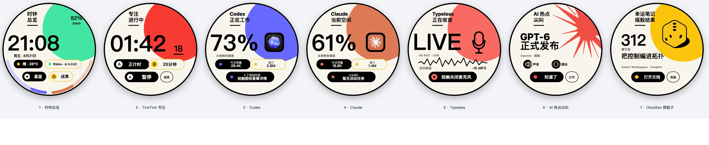

# M5 StopWatch Dashboard

> Alice 的个人分支以好友@Googler0825 的开源 Dashboard 为底座，并持续针对实际工作流、
> 圆屏交互与本地隐私边界进行加固。

这不是把电脑仪表盘硬塞进一块圆屏，而是 Alice 的一张桌面工作切片：它会报时、盯住专注、
看看 Coding AI 今天忙成什么样，在真正重要的 AI 消息到来时尖叫一声，也会从 Obsidian 里
捞起一篇很久没有见过的笔记。

## 一块表，三个程序

开机先进入程序选择器：A/B 在 `Dashboard`、本地 `Stopwatch` 和 `Timer` 之间切换高亮；
轻触任一程序卡可直接进入对应程序。

- **Dashboard** 是七屏个人工作台，连接 Mac Bridge 后获得 TickTick、AI 用量、热点、
  Obsidian 与 Typeless 能力。
- **Stopwatch** 保留独立的本地秒表体验，不联网也能开始、暂停、记圈和复位。
- **Timer** 是完全离线的本地倒计时器，A/B 保存两个可调分钟预设，到点后以屏幕、振动和
  双响门铃提醒，并继续显示超时正计时。

## Dashboard 的七个世界

| 屏幕 | 它在做什么 | 可以怎么用 |
|---|---|---|
| 1. 时钟总览 | 显示时间、跳秒、日期、本地天气、电量、TickTick 进度与当天全部 Coding AI Token | 轻触 `星盘` 看正在运行的任务，轻触 `成果` 回看今天完成的工作 |
| 2. TickTick 专注 | 把正计时和 25 分钟倒计时放在同一页 | A 控制正计时，B 控制倒计时；单击开始/暂停/继续，双击结束 |
| 3. Codex | 显示当前状态、剩余额度、重置时间、今日与累计用量 | 有活动任务时轻触 Codex 图标查看详情；对话内容默认保持私密 |
| 4. Claude Code | 显示 Claude Code 的活动、额度窗口与 Token 用量 | 有活动任务时轻触 Claude 图标查看详情；没有任务时保持安静 |
| 5. Typeless | 插线时把 StopWatch 变成 48 kHz USB 麦克风，拔线时降级为 Mac 麦克风遥控器 | `USB MIC` 临时接管输入、结束后归还原麦克风；`MAC MIC` 经 Wi-Fi 启停 Typeless 并保留电脑麦克风；两条 Bridge 链路都不可用时显示 `NO BRIDGE` |
| 6. AI 热点尖叫 | 监听 Codex Reset、AIHOT、DeepSeek、Kimi 与官方信源；重大模型、额度或安全事件才真正“尖叫” | 新热点会播放声音并震动；`知道了` 与 `打开` 使用适配圆屏边缘的扩大触摸区，并在 Mac 打开原文 |
| 7. Obsidian 幸运笔记 | 从明确授权的知识库随机重遇一篇笔记 | 轻触骰子、点 `再摇` 或晃动设备重新抽取；点 `打开文档` 回到 Obsidian |



## 按键与电源

在 Dashboard 中，A/B 是全局专注键，无论当前停在哪一屏，操作后都会自动切到第 2 屏反馈：

- **A 单击**：正计时开始、暂停或继续；**A 双击**：结束正计时并保留本次用时。
- **B 单击**：25 分钟倒计时开始、暂停或继续；**B 双击**：结束并回到 `25:00`。
- **A 长按 0.8 秒**：打开网络选择；**B 长按 0.8 秒**：回到第 1 屏，不改变计时状态。
- **A+B 长按 2.5 秒**：主动进入配网。

红色电源键负责整块表的状态：

- **短按**：熄屏或唤醒。熄屏时关闭显示、触控与麦克风，但 Wi-Fi、扬声器和震动仍待命；
  若此时收到 AI 尖叫，下一次唤醒会直接进入第 6 屏。
- **双击**：运行中从任意页面回到程序选择器；真关机后双击开机。
- **长按**：未连接 USB 时，约 `0.7 秒`进入可取消的关机预告；继续按到约 `2.5 秒`才真正
  关机，阈值前松手会取消并恢复原界面。连接 USB 时软件不截获长按，继续按住约 2 秒会
  进入原厂 Download Mode，方便烧录与救援。

短按熄屏会快速淡出并轻震；真关机显示 `POWER OFF · SHUTTING DOWN`，冷启动显示
`M5 DASHBOARD · STARTING`，因此可以直观看出当前只是熄屏，还是完整关机/开机。

触摸屏左右滑动切换七屏；左侧 `2/5` 纵向滑动调节亮度，右侧 `2/5` 纵向滑动调节
提示音量，上滑增加、下滑降低。中间 `1/5` 是纵向调节安全区，不触发亮度或音量，
但仍可左右滑动切换页面。

进入独立 Stopwatch 后，A/B 会恢复秒表语义：静止时 B 开始；运行时 A 记圈、B 暂停；
暂停时 A 复位、B 继续。这里不另设 A/B 双击或长按动作，电源键契约保持不变。

进入独立 Timer 后，默认 A 为 8 分钟、B 为 10 分钟：待机时按对应实体键开始，运行或
超时后再按同一键暂停/继续，另一个键不会误切当前计时。运行中 `RESET` 置灰，暂停后才可
结束并归位；待机时点 `SET` 可选择 A/B 并上下拖动分钟滚轮，短滑精调、长滑加速，
`SAVE` 将 1–99 分钟预设保存到设备。到点后播放约 2 秒的下降式双响门铃。

## 项目里有什么

- `m5-dashboard/`：M5 固件、通用 Mac 桥接、安装脚本和测试。
- `m5-dashboard-home/`：只读取本机 Claude Code 日志的轻量伴随桥接。

## 按需安装的伴随项目

Dashboard 本体可以独立安装，但不同屏幕的数据来自不同的本机服务；不使用某项功能时，
不必为了凑齐七屏而安装所有依赖。

| 伴随项目 | 是否必装 | 提供什么 |
|---|---|---|
| [Multi AI Usage Monitor](https://github.com/isalicema/api-usage-board) | 推荐，但不是启动 Dashboard 的硬依赖 | 首页当天全部 Coding AI Token，Codex/Claude 的统一配额与重置窗口，Claude 今日及可回溯累计 Token；还可汇总 Kimi Code、DeepSeek、OpenRouter 与 Grok |
| [M5StickS3 TickTick Focus Bridge](https://github.com/isalicema/m5stick-ticktick-focus) | 只在使用第 2 屏时需要 | TickTick 正计时、25 分钟倒计时及今日专注累计 |
| Typeless for macOS | 只在使用第 5 屏时需要 | USB 手表麦克风或 Wi-Fi `MAC MIC` 听写 |

没有安装 Multi AI Usage Monitor 时，Codex 仍可从本机 App Server、Hooks 与 session 日志显示
活动任务、官方额度和本机今日用量；Claude Code 仍可显示本机活动任务。此时首页 AI 汇总显示
`AI--`，Claude 的 Token/额度增强字段不可用。若不打算安装，可在本机 `config.json` 中将
`ai_usage.enabled` 设为 `false`，不会影响时钟、专注、Typeless、热点或 Obsidian。

## 两条完成动画路线

Codex 与 Claude Code 的完成动画刻意采用两条独立路线，不把普通工具调用或 thinking
误判成任务完成：

- **Codex** 搭载产品自身的 `notify` / `agent-turn-complete` 终态通知。它可以与 peon-ping
  等音效共用同一个回调，因此声音与手表动画几乎同时抵达。
- **Claude Code** 默认由 Bridge 轻量读取 `~/.claude/projects` 会话 JSONL。只有带可见最终
  回复的 `end_turn` 才生成完成动画；`tool_use`、`pause_turn`、`max_tokens` 和仅有 thinking
  的 `end_turn` 都继续视为工作中。

两条路线都只向手表发送完成时间和默认匿名任务标识；任务标题与对话预览仍需在本机配置中
显式开启。Claude 不要求安装 peon-ping，也不依赖它是否成功播放音效。详细安装与旧式 Hook
兼容方式见 [Bridge 说明](m5-dashboard/README.md#3-安装-codex-hook-与常驻服务)。

## 安全与隐私

- 公开示例默认关闭任务标题和对话预览。
- 真实的 `config.json`、TickTick/桥接令牌、`secrets.h`、任务日志、构建缓存
  和 `dist/` 均被 `.gitignore` 排除。
- 天气地点、Obsidian 根目录与 Mac 名称都属于本机配置；公开示例不包含维护者的真实地址、
  Wi-Fi 或局域网主机信息。
- 局域网接口必须使用随机 Token，不能映射到公网。
- 本地 Claude 模式只读取 `~/.claude/projects` 会话日志，不读取浏览器 Cookie、Keychain
  或官方账户接口。

## 固件

仓库不跟踪预编译固件。可按 [固件构建说明](m5-dashboard/README.md#platformio) 自行编译；
项目维护者也可以通过 [GitHub Releases](../../releases) 提供已验证的应用分区镜像。
首次安装和故障救援仍使用 USB。救援脚本只重置原厂 `otadata` 并写入 `ota_0`
（起点 `0x20000`），不会执行 `erase_flash`，因此 NVS 中保存的 Wi-Fi、令牌和设备设置会保留。

首次用 USB 装入支持 OTA 的固件后，后续版本可由可信局域网内的 Bridge 提供。手表只在首页、
亮屏且没有计时、听写或动画等交互时检查更新；候选镜像会流式写入当前未运行的另一 OTA 分区，
并在大小、SHA-256 与 ESP 应用镜像三项校验全部通过后才切换启动分区。发布仍是显式动作，Bridge
没有候选时不会更新。完整操作见 [HTTP OTA](m5-dashboard/README.md#5-http-ota)。

## 验证

```bash
cd m5-dashboard
python3 -m unittest discover -s tests -v

cd ../m5-dashboard-home
python3 -m unittest discover -s tests -v
```

```bash
cd m5-dashboard/firmware
pio run -e m5stack-stopwatch-uac
```

完整配置、安装、操作与已知边界见 [m5-dashboard/README.md](m5-dashboard/README.md)。

## 许可证

本项目原创代码采用 [MIT License](LICENSE)。项目引用或包含的第三方内容继续遵循各自
许可证；相关声明见 `m5-dashboard/third_party/`。
